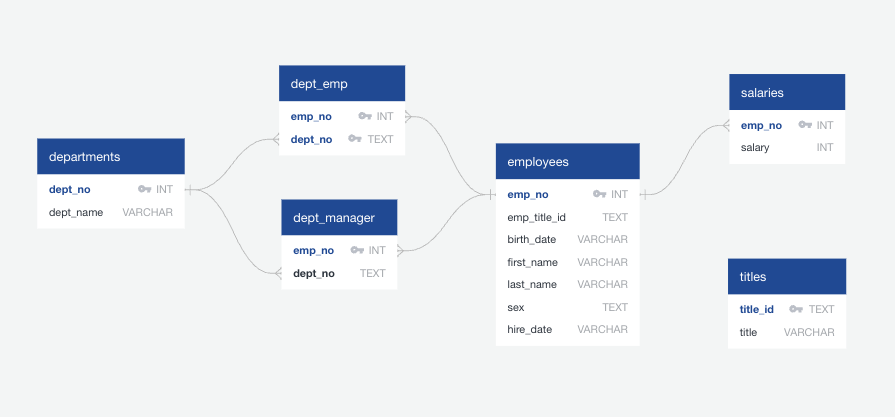

# SQL Challenge
This project is intended to do a research project about the people who were employed at Pewlett Hackard during the 1980s and 1990s. This will be done using provided CSV files and postgreSQL.

## Entity Relationship Diagram

## Code Source
For this project, I worked with classmates, Matthew and Jenni to work on various parts of the project. I also used previous classwork to create the code as well as ChatGPT to troubleshoot.